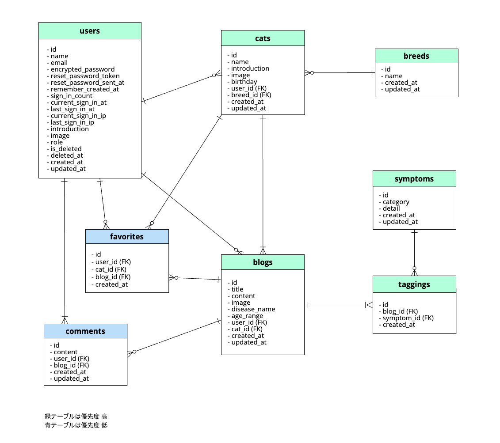

# README

## アプリ名 「Cat Saver キャットセーバー」

猫の症状から病名・体験記を検索できるアプリです。

## 開発言語

- Ruby 3.0.1
- Rails 6.1.7

## 就職 Term の技術

- AWS EC2
- gem devise

## カリキュラム外の技術

- gem ransack
- gem pagy
- gem ActiveAdmin
- Active Storage
- ChatGPT API

## 実行手順

```
$ git clone git@github.com:MinamiMurata/CatSaver.git
$ cd CatSaver
$ bundle install
$ yarn install
$ rails db:create
$ rails db:migrate
$ rails db:seed_fu
$ rails s
```

## カタログ設計

https://docs.google.com/spreadsheets/d/1Dv-C76zhcnrZLJFD1tw77y_CUSpnhz7eRJjTkrpY9O4/edit?usp=sharing

## テーブル定義書

https://docs.google.com/spreadsheets/d/1Dv-C76zhcnrZLJFD1tw77y_CUSpnhz7eRJjTkrpY9O4/edit?usp=sharing

## ワイヤーフレーム

https://cacoo.com/diagrams/6i0Xpy2MyIPyQXiu/46AE5

## ER 図



## 画面遷移図


